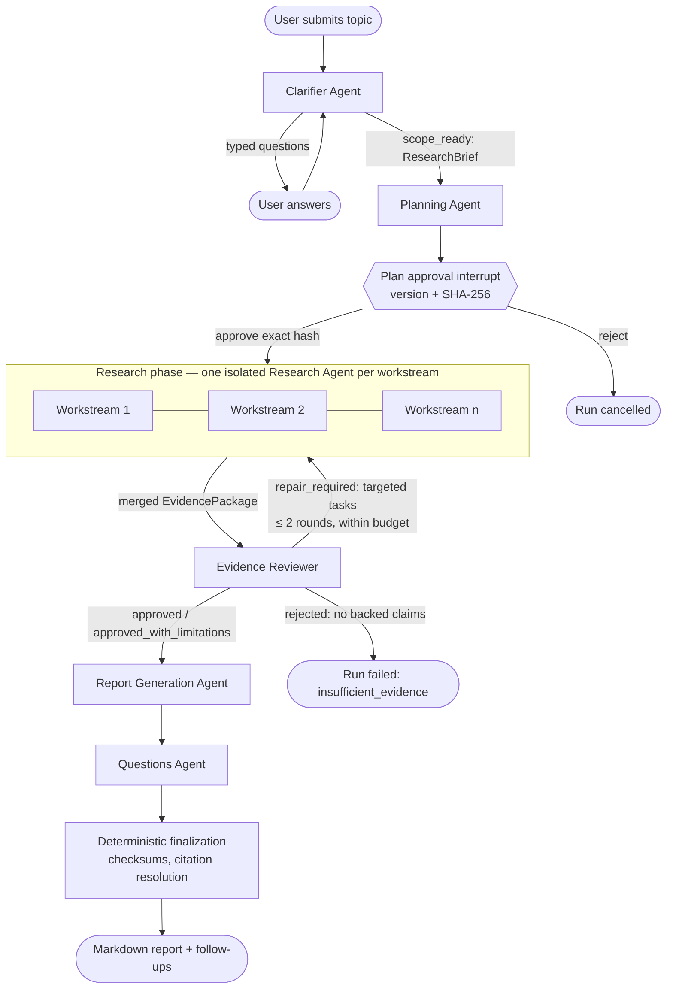

# Deep Research

**A production-grade, multi-agent deep-research system that turns a one-line question into an
evidence-backed, citation-verified Markdown report, with a human approving the plan before a
single web request is made.**

Python 3.13 · AWS Strands Agents · FastAPI · Pydantic v2 · Playwright · Tavily ·
Anthropic / OpenAI / Amazon Bedrock · DynamoDB / SQS adapters · Cognito JWT auth ·
162 mocked tests + opt-in live suite

Give it `"Compare the Samsung S90D, LG C4, and Sony Bravia 8 for a 65-inch home theater"` and
it will ask two clarifying questions, propose a versioned research plan for approval, fan out six
parallel research workstreams over 41 web searches and 46 fetched pages, review 225 normalized
claims, and write a 4,000-word report in which every `[S…]` citation resolves to a real captured
source. Two finished runs are committed as [sample reports](#sample-reports).

---

## Contents

- [Why this project](#why-this-project)
- [Capabilities](#capabilities)
- [How a run works](#how-a-run-works)
- [Multi-agent architecture](#multi-agent-architecture)
- [Evidence integrity model](#evidence-integrity-model)
- [Reliability and operations](#reliability-and-operations)
- [Security model](#security-model)
- [Sample reports](#sample-reports)
- [Quickstart](#quickstart)
- [CLI reference](#cli-reference)
- [Configuration](#configuration)
- [HTTP API](#http-api)
- [Testing](#testing)
- [Troubleshooting](#troubleshooting)
- [Project layout](#project-layout)
- [Roadmap](#roadmap)

---

## Why this project

Most "deep research" demos are a single agent in a tool-calling loop: it searches, reads, and
writes, and you trust whatever it says. That approach fails in exactly the places that matter for
real use: it hallucinates citations, it spends unbounded money and time, it cannot be paused for
human approval, it forgets everything if the process dies, and it treats every web page it reads
as trusted instructions.

This project takes the opposite stance. It is a **bounded, typed, durable multi-agent workflow**
in which:

- **Agents never hold tools or credentials.** Each agent returns a validated Pydantic model. The
  application decides what to execute, with run-bound adapters that carry the tenant and run
  identity so a model can never pick a different index, browser session, or key.
- **Nothing becomes evidence unless the application fetched it.** Search snippets are discovery
  metadata only. Every claim must select exact excerpt segments from pages the system opened
  itself, and every citation in the final report is validated against that chain.
- **Humans stay in the loop at the two points that matter:** clarification before planning and
  approval of the exact plan (version plus SHA-256 hash) before any research spend.
- **Every phase is a checkpointed job.** A run survives process restarts, duplicate queue
  deliveries, and cooperative cancellation, and it resumes from the last completed node.
- **Failure is classified, not retried blindly.** Deterministic failures (validation, output
  ceilings, exhausted billing) fail fast with a distinct code; transient ones are retried; a
  report that loses its prose still ships as a fully cited deterministic fallback.

It was designed from an [architecture plan](arch_plan/deep-research-system-plan.md) written
first, then implemented and hardened by running quick and deep research end to end against the
live web until both completed.

---

## Capabilities

### Research quality

- **Clarify → plan → approve → research → review → report → follow-ups**, each stage a
  separate agent with a typed contract and no access to the others' prompts.
- **Adaptive clarification**: up to three rounds of typed questions (free text, single-select,
  multi-select, confirmation, date range), collapsing to a best-interpretation confirmation.
- **Versioned, hash-approved plans** with research questions, an acyclic workstream DAG,
  per-workstream candidate queries, source-priority strategy, report outline, and budget.
- **Parallel research workstreams** executed in dependency waves under the plan's concurrency
  limit, each producing normalized claims bound to exact evidence segments.
- **An internal evidence reviewer** that scores every source on authority, freshness,
  relevance, independence, and accessibility; flags unsupported and overconfident claims;
  surfaces contradictions; and issues *targeted* repair tasks (up to two rounds) that cannot
  exceed the remaining query or source budget.
- **Deterministic report assembly**: exact approved outline, per-section citation mapping,
  reviewer limitations preserved verbatim, unresolved contradictions listed, a source appendix,
  a SHA-256 checksum, and strict Mermaid validation with prose fallback.
- **Follow-up question generation** linked to the completed report's sections.

### Depth presets

| Preset | Target duration | Search queries | Accepted sources | Parallel workstreams | Review repair rounds |
|---|---|---|---|---|---|
| `quick` | 5 min | 5 (+1 adaptive) | 10 | 3 | 1 |
| `standard` | 15 min | 20 | 30 | 6 | 2 |
| `deep` | 20 min | 50 | 75 | 10 | 2 |

Ceilings are application-owned: the planner is told them, but the worker enforces them.

### Platform

- **Three model providers** (Anthropic, OpenAI, Amazon Bedrock) through one YAML-routed
  gateway with per-role targets, whole-operation retries, and provider fallback that never mixes
  partial outputs.
- **A REST control plane** (FastAPI) with idempotent commands, optimistic concurrency,
  replayable cursor-based events, and a Markdown report endpoint.
- **A durable worker** with in-memory or SQS dispatch and in-memory or DynamoDB persistence,
  sharing the same service boundaries as the API.
- **A local CLI** that drives the whole workflow interactively (or unattended with
  `--auto-approve-plan`) through those same boundaries.
- **Cognito access-token verification** (JWKS cache, issuer, signature, client, token use,
  expiry, scopes, tenant claim) with a fixed-identity development mode.
- **Private document ingestion** (PDF, DOCX, TXT, Markdown): quarantine, magic-byte and
  archive validation, fail-closed ClamAV scanning, location-preserving chunking, and
  tenant/run-filtered OpenSearch retrieval.

---

## How a run works



The run record, not an open connection, is the source of truth. States move
`DRAFT → CLARIFYING → PLANNING → AWAITING_PLAN_APPROVAL → RESEARCHING → REVIEWING →
GENERATING_REPORT → GENERATING_QUESTIONS → COMPLETED`, with `FAILED`, `CANCELLED`, and
`EXPIRED` as terminal alternatives. Every transition persists a new run revision plus one
immutable, ordered event, atomically with the idempotency response.

What actually happens inside the research phase for one workstream:

1. The approved candidate queries go to Tavily (discovery only; snippets are never evidence).
2. Candidate URLs are canonicalized, de-duplicated, ranked (social-media hosts last), and fetched
   through an isolated Playwright Chromium context with an SSRF guard, bounded redirects, size
   and length ceilings, PDF text extraction, and a bounded settle wait for hydrated pages.
3. Captured pages become *materials*, sliced into 1,500-character *evidence segments* with
   short prompt-local IDs (`M1`, `G7`).
4. The Research Agent, with no tools, synthesizes normalized claims that must cite those segment
   IDs, stay inside the approved questions and sections, and respect a per-depth claim ceiling.
5. The application validates every reference, drops anything invalid after one repair, and
   mints stable content-derived IDs: sources from canonical URL, excerpts from source + location +
   text, claims from question + sections + text. Parallel workstreams therefore merge without
   coordination.

---

## Multi-agent architecture

The system is a **deterministic, bounded graph**, not an autonomous swarm. Agents do not hand off
to each other in free-form prose; the application routes typed payloads between them and owns
every ceiling, retry, and state transition.

| Agent | Input contract | Output contract | Tools | What the application enforces |
|---|---|---|---|---|
| Clarifier | `ClarifierRequest` (topic, prior answers, current brief, round) | `ClarificationDecision` | none | ≤ 5 questions/turn, ≤ 3 rounds, quick-depth caps, forced confirmation |
| Planner | `PlannerRequest` (brief, depth, uploads, edits, previous plan) | `ResearchPlanDraft` → `ResearchPlan` | none | query/source ceilings, acyclic DAG, quick-mode shape limits, version + hash |
| Researcher (×N) | `ResearchRequest` (plan, task, repair task, usage) | `ResearchSynthesisDraft` → `ResearchResult` | none (adapters run by app) | permitted tools, scope, segment references, claim ceiling, stable IDs |
| Evidence Reviewer | `ReviewerRequest` (plan, evidence, usage, round) | `ReviewDraft` → `ReviewResult` | none | exact ID coverage, budget-bound repair tasks, deterministic coverage/integrity checks |
| Report Generator | `ReportRequest` (plan, evidence, review, usage) | `ReportDraft` → `ReportArtifact` | none | exact outline, per-section citation mapping, limitations preserved, Mermaid safety, length ceilings |
| Questions | `QuestionsRequest` (report context) | `FollowUpQuestionSet` | none | 5–10 prioritized, section-linked questions |

Design choices worth noting:

- **Structured output everywhere.** Every model call goes through one `ModelGateway` that asks
  Strands for a Pydantic model as the response. There is no prose parsing anywhere in the
  control path.
- **Validate, repair once, then degrade.** Each agent gets exactly one repair prompt containing
  the deterministic validation error. If the second attempt is still invalid, the system degrades
  in a way that keeps integrity: drop the invalid claims, omit the unsafe diagram, trim the
  over-length paragraph, or assemble the report deterministically from reviewed claims. It never
  ships an unvalidated citation and never discards good work over a cosmetic failure.
- **Strands `GraphBuilder` defines the topology and its bounds** (entry point, conditional edge
  from reviewer back to research, node and execution timeouts, max node executions). A
  `DurableWorker` executes each node as a checkpointed job so the graph's progress lives in the
  run record rather than in process memory.
- **One Research Agent instance per workstream, one adapter per phase.** Workstreams are
  isolated but share a single-flight page cache, so a page that three queries surface is fetched
  once and every workstream sees identical content.
- **Untrusted content is labeled as such in every prompt.** Briefs, plans, page text, and
  upload metadata are passed as "untrusted JSON" data, and every system prompt states that they
  are never instructions.

---

## Evidence integrity model

The claim you read in the report can be traced backwards without trusting any model:

```
report paragraph "[S421…]"  →  SourceRecord S421… (canonical URL, content hash, access date)
        ↑ validated per section
EvidenceClaim C…  →  evidence_ids [E…]  →  EvidenceExcerpt E… (verbatim segment, location)
        ↑ must map to the section          ↑ derived from source + location + text
ResearchSynthesisDraft claim  →  DraftEvidenceSelection (M3, G17)  →  CapturedMaterial M3
        ↑ model-authored                    ↑ application-sliced from the fetched page
```

Guarantees enforced in code, each with tests:

- A claim that is not an inference must select at least one captured segment, and every
  selection must name a material and a segment that exist and belong together.
- Source IDs are content-derived, so the same URL captured by two workstreams (or two repair
  rounds) merges into one source; if a dynamic page hashed differently between captures, the
  first capture wins and the source is flagged rather than the run failing.
- The report may cite a source in a section only if some claim mapped to that section rests on
  an excerpt from that source. Multi-source brackets like `[S1, S2]` are normalized; anything
  else that looks like a citation but does not resolve is rejected.
- Every material paragraph in a findings section, the executive summary, and the conclusion
  needs a citation unless it is prefixed `Inference:` or `Analysis:`.
- Reviewer limitations and contradictions must appear in the report verbatim.
- Finalization re-verifies the review's evidence checksum, the report's plan hash, Mermaid
  validity, and citation resolution before marking the run complete.

---

## Reliability and operations

**Durable phase jobs.** Starting a run, answering clarification, and approving a plan each
enqueue a typed `PhaseJob` bound to the run revision and, after approval, the exact plan version
and hash. The worker checkpoints before the approval interrupt and after every completed
workstream, so a replacement worker resumes from the canonical checkpoint and duplicate
deliveries are absorbed by optimistic revisions and node-scoped idempotency keys.

**Failure classification.** The worker decides per exception whether redelivery could help:

| Failure code | Cause | Behavior |
|---|---|---|
| `worker_validation_error` | agent output or checkpoint failed a deterministic check | fail on first delivery |
| `model_output_limit` | model stopped at its `max_tokens` ceiling | fail on first delivery |
| `model_provider_rejected` | billing exhausted, bad credentials, invalid request | fail on first delivery, no budget re-spent |
| `research_service_configuration` | plan needs a capability that is deliberately unconfigured | fail on first delivery |
| `insufficient_evidence` | review found no evidence-backed claim | fail without generating a report |
| `worker_retry_ceiling` | transient errors exhausted the delivery limit | fail after N deliveries |
| `worker_conflict_ceiling` | persistent optimistic-concurrency conflicts | fail after N deliveries |

**Budget accounting.** Elapsed time, searches, fetched sources, and model calls are recorded
monotonically on every checkpoint, clamped to the plan's ceilings, and consulted before each
research wave and review. Exhaustion produces explicit limitations rather than silently extending
limits.

**Cooperative cancellation.** A cancel request is persisted; every agent boundary and every
research step checks it, and in-flight page fetches are released without cancelling sibling
workstreams.

**Observability.** `--verbose` (or standard logging configuration) emits the model route selected
per role, every provider failure with attempt counts, and adapter failures, never prompts,
evidence text, or keys. Worker events carry only safe metadata: phase, counts, checksums, budget
totals.

---

## Security model

- **SSRF guard on every browser request**, including sub-resources: HTTP(S) only, no embedded
  credentials, standard ports only, no `localhost`/`.local`, DNS-resolved addresses must be
  globally routable, redirects re-validated, image/media/font requests aborted. Verdicts are
  cached per fetch so the guard does not become the bottleneck.
- **Prompt-injection posture**: agents have no tools; fetched text and user-supplied metadata are
  passed as data with explicit untrusted labels; nothing a page says can change scope, tools, or
  identity because the application, not the model, owns those.
- **Tenant isolation**: owner and tenant come from the authenticated principal, never from the
  request body; every repository read is owner/tenant-scoped; upload retrieval injects
  `tenant_id` and `run_id` filters server-side; research adapters are constructed per run.
- **Credentials**: loaded from `.env` or the AWS credential chain by `pydantic-settings`, passed
  directly to the provider client, never logged and never placed in a prompt.
- **Uploads fail closed**: scanner unavailability or an indeterminate result blocks ingestion;
  local artifacts are written with `0600` permissions into quarantine/original/extracted prefixes.

---

## Sample reports

Two completed runs are committed under [`reports/`](reports/) exactly as the CLI wrote them.

| Report | Depth | Topic | Run profile |
|---|---|---|---|
| [Quick research sample report](reports/Quick%20research%20sample%20report.md) | `quick` | "Give me a summary of Samsung's S90D TV" | 6.5 min · 2 workstreams · 5 cited sources · 1 repair round |
| [Deep research sample report](reports/Deep%20research%20sample%20report.md) | `deep` | Samsung S90D vs LG C4 vs Sony Bravia 8 for a 65-inch home theater, model numbers pinned | 32 min · 6 parallel workstreams · 41 searches · 46 fetched sources · 225 reviewed claims · 36 cited sources |

Read them with the integrity model above in mind: every `[S…]` resolves in the `Sources`
section, the `Limitations` section is the reviewer's own list (paywalled measurements,
discontinued models, anecdotal forum reports), and `Unresolved contradictions` names the
claims that disagree and why.

Both were produced by the **deterministic fallback path**: the model's prose draft failed a hard
citation check twice (an uncited executive-summary paragraph in the quick run; `[S1, S2]`-style
brackets in the deep run, which are now normalized before validation), so the report agent
assembled each section directly from reviewed, evidence-backed claims. That is the system working
as designed, favoring a verifiable claim list over unverifiable prose, and the reports say so in
their own limitations.

---

## Quickstart

Requires Python 3.13, a Tavily API key, and one model provider.

```bash
python3.13 -m venv .venv
source .venv/bin/activate
python -m pip install --upgrade pip
pip install -e '.[dev]'
playwright install chromium
cp .env.example .env
```

Edit `.env` for one provider (model IDs set here are honored by `config/models.yaml`):

```dotenv
MODEL_PROVIDER=anthropic          # or openai | bedrock
ANTHROPIC_API_KEY=replace-me
ANTHROPIC_MODEL_ID=claude-sonnet-4-6
TAVILY_API_KEY=replace-me
UPLOADS_ENABLED=false
```

For OpenAI use `OPENAI_API_KEY` / `OPENAI_MODEL_ID`; for Bedrock use the standard AWS credential
chain with `AWS_REGION` / `DEFAULT_MODEL_ID`. Verify the toolchain without spending anything:

```bash
pytest                      # 162 mocked tests, no credentials needed
```

Run a quick piece of research interactively:

```bash
deep-research-run "Give me a summary of Samsung's S90D TV" --depth quick --output reports/
```

You will answer any clarification questions, see the generated plan, and be asked to approve its
exact version and hash. Or run unattended:

```bash
deep-research-run "Summarize current fusion milestones" --depth quick --auto-approve-plan --verbose
```

Start the API and worker together for the HTTP surface:

```bash
deep-research-dev           # http://127.0.0.1:8000
```

---

## CLI reference

```text
deep-research-run TOPIC [--depth quick|standard|deep] [--provider openai|anthropic|bedrock]
                        [--output PATH] [--auto-approve-plan] [--verbose]
```

- `--depth` defaults to `standard`; see the [presets table](#depth-presets).
- `--provider` overrides `MODEL_PROVIDER` for that invocation.
- `--output` is used directly if it ends in `.md`; a directory receives `<run_id>.md`
  (default `research-reports/`).
- `--auto-approve-plan` is the only way to skip the approval prompt. When stdin is not a
  terminal the CLI refuses to start without it and exits 2 with a clear message; if a
  clarification question still needs an answer it cancels the run cooperatively.
- `--verbose` logs model routing, provider fallbacks, and adapter failures to stderr.
- Ctrl-C persists a cooperative cancellation request.

Reviewing the plan is worth the pause. Rejecting cancels the run, so if the planner has
misidentified a product (treating a model name as its predecessor, say), restart with the exact
model numbers in the topic. Quick runs typically finish in 6 to 9 minutes of wall time; deep runs
in about 30 and send on the order of a million input tokens, so keep credit headroom.

---

## Configuration

All settings load from `.env` (or the environment) through `pydantic-settings`; see
[`.env.example`](.env.example) for the full list.

| Setting | Purpose |
|---|---|
| `MODEL_PROVIDER`, `MODEL_FALLBACK_ORDER` | Primary provider and optional comma-separated fallback order. The selected provider is always tried first. |
| `ANTHROPIC_API_KEY`, `OPENAI_API_KEY` | Direct-provider keys. Bedrock uses the AWS credential chain. |
| `ANTHROPIC_MODEL_ID`, `OPENAI_MODEL_ID`, `DEFAULT_MODEL_ID`, `AWS_REGION` | Substituted into `config/models.yaml` placeholders. |
| `TAVILY_API_KEY`, `TAVILY_BASE_URL`, `PLAYWRIGHT_HEADLESS` | Public-web research adapters. |
| `AUTH_MODE`, `COGNITO_ISSUER`, `COGNITO_CLIENT_ID`, `COGNITO_REQUIRED_SCOPES`, `COGNITO_TENANT_CLAIM` | `development` injects a fixed local identity; `cognito` requires bearer access tokens. |
| `DYNAMODB_RUNS_TABLE`, `SQS_JOBS_QUEUE_URL`, `RUN_RETENTION_DAYS` | Leave empty for process-local persistence and dispatch. |
| `UPLOADS_ENABLED`, `OPENSEARCH_*`, `CLAMAV_*`, `UPLOAD_ARTIFACT_ROOT` | Private-document ingestion and retrieval; nothing is constructed while uploads are disabled. |

[`config/models.yaml`](config/models.yaml) maps each agent role to an ordered list of targets.
Every target allows 16k output tokens with a 4-to-5-minute timeout: deep-depth plans, syntheses,
and reviews are large structured documents, and a smaller ceiling makes the model stop mid-output
(`model_output_limit`). Report targets get the longest timeout.

---

## HTTP API

Run control plane (every mutating request needs an `Idempotency-Key` header of 8–200
characters; reusing a key for the same command replays the original response, reusing it for
different input returns `409`):

```text
POST /v1/runs                          create (topic, depth, safe upload metadata)
POST /v1/runs/{run_id}/start           enqueue the clarifier
GET  /v1/runs/{run_id}                 run record with checkpoint summary and budget usage
POST /v1/runs/{run_id}/clarifications  {"round_number": 1, "answers": [{"question_id": …, "value": …}]}
PUT  /v1/runs/{run_id}/plan            save a replacement plan version (new hash) for approval
POST /v1/runs/{run_id}/plan/approve    {"version": 1, "content_hash": "<sha256>"}  (exact match or 409)
POST /v1/runs/{run_id}/cancel          cooperative cancellation
GET  /v1/runs/{run_id}/events?after=N  cursor-based, replayable, safe metadata only
GET  /v1/runs/{run_id}/report          text/markdown once COMPLETED, 409 before
```

Agent debug endpoints (`POST /v1/clarifier/evaluate`, `/v1/planner/generate`,
`/v1/researcher/research`, `/v1/reviewer/review`, `/v1/report/generate`,
`/v1/questions/generate`) exist only when `create_app` is given an explicit gateway or
`expose_agent_debug_routes=True`; the production app never constructs agents in the request
process.

Deployment shape: `deep-research-dev` runs API and worker in one process on shared in-memory
adapters. Production separates `deep_research.api.app:app` from `deep-research-worker`, which
require `SQS_JOBS_QUEUE_URL` and `DYNAMODB_RUNS_TABLE` (single table, `PK`/`SK` string keys,
numeric `expires_at` TTL, conditional transactional writes). The full AWS design (AgentCore
Runtime, S3 artifacts, OpenSearch Serverless, Cognito, OpenTelemetry) is in the
[architecture plan](arch_plan/deep-research-system-plan.md).

---

## Testing

```bash
pytest            # mocked: 162 deterministic tests, no credentials, ~4 s
pytest -m live    # opt-in: calls the configured model, Tavily, and the public web
ruff check src tests
```

The mocked suite fakes the model gateway and research adapters and covers each agent's
validation and repair paths, evidence merging, the page cache (including cancellation and
garbage-collection behavior), SSRF guard caching, worker failure classification, checkpoint
resumption, budget clamping, control-plane transitions and idempotency, Cognito verification,
upload ingestion, and the CLI's interactive and non-interactive paths.

The live suite uses quick budgets and covers every model role, provider routing, Tavily followed
by Playwright, clarification resume, exact approval, cancellation during research, and a complete
public-web workflow with citation resolution. Missing credentials cause clean skips.

---

## Troubleshooting

- **Provider credential error at startup**: `MODEL_PROVIDER` must match the populated key; blank
  values count as missing. For Bedrock, `aws sts get-caller-identity` must succeed in the same
  shell.
- **Chromium executable missing**: run `playwright install chromium` inside the active venv.
- **`model_output_limit`**: raise `max_tokens` and `timeout_seconds` for that target in
  `config/models.yaml`. The run is not retried because the same prompt would hit the same
  ceiling.
- **`model_provider_rejected`**: the provider refused for a reason retrying will not change,
  usually an exhausted credit balance or an invalid key; the message carries the provider's
  text. Nothing was redelivered, so no search or fetch budget was re-spent.
- **`worker_validation_error`**: an agent's output or a checkpoint failed a deterministic check
  on the first delivery; the message names the check.
- **`insufficient_evidence`**: no workstream produced an evidence-backed claim. Check the printed
  limitations for fetch failures (timeouts, 403s, paywalls) and broaden the topic.
- **Report says "assembled deterministically"**: the model's prose failed a hard citation or
  outline check twice, so the report was built from reviewed claims. See
  [Sample reports](#sample-reports).
- **Tavily 401/403 or empty discovery**: verify `TAVILY_API_KEY`, quota, and outbound HTTPS.
- **Public URL rejected**: the SSRF guard is not configurable by design.
- **Run vanished after restart**: the default in-memory repository is process-local; configure
  DynamoDB and SQS for cross-process durability.

---

## Project layout

```text
src/deep_research/
  agents/          clarifier, planner, researcher, reviewer, report, questions (+ cancellation)
  contracts/       Pydantic contracts: clarification, planning, research, evidence, reporting,
                   questions, runs, jobs, orchestration checkpoint
  orchestration/   bounded Strands GraphBuilder topology
  worker.py        DurableWorker: phase handlers, checkpoints, budget accounting, failure classes
  services/runs.py RunControlService: lifecycle, idempotency, events, approval hashing
  persistence/     in-memory and DynamoDB run repositories
  jobs/            in-memory and SQS phase-job dispatchers
  models/          YAML-routed multi-provider ModelGateway with structured output
  tools/           Tavily search, Playwright fetcher with SSRF guard, page cache, URL canon.
  uploads/         ingestion pipeline and OpenSearch retrieval
  auth/            Cognito token verification and development identity
  api/             FastAPI application and routes
  cli.py           interactive / unattended local runner
  dev_app.py       single-process API + worker composition
tests/             162 mocked tests; tests/live/ opt-in live suite
config/models.yaml role → provider target routing
arch_plan/         the design document the implementation follows
reports/           two committed sample reports (other output is git-ignored)
```

About 9,500 lines of application code and 5,000 lines of tests.

---

## Roadmap

- Presigned S3 upload endpoints and the quarantine-event workflow (ingestion and retrieval are
  implemented; the browser-facing upload API is not).
- Server-Sent Events on top of the existing cursor-based event log.
- Plan editing from the CLI (the API supports `PUT /plan`; the CLI currently approves or cancels).
- Cross-run fetch caching and per-workstream source de-duplication in budget accounting.
- Prompt work so the model's prose draft clears the citation gate more often; the deterministic
  fallback is correct but reads as a claim list.
- PDF export and rendered diagram artifacts.
