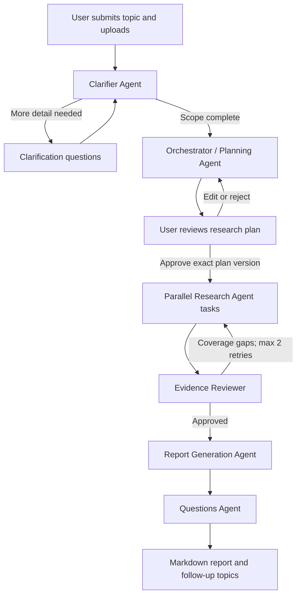

# AWS Strands Deep Research System

## 1. Executive summary

This document defines a multi-user deep research application built with the AWS Strands Agents SDK. A user submits a topic and optional private documents, answers targeted clarification questions, reviews and approves a research plan, watches the work progress, and receives an evidence-backed Markdown report containing claim-level citations, validated Mermaid diagrams, and suggested follow-up topics.

The system uses a deterministic, bounded Strands `Graph` rather than autonomous swarm handoffs. It contains the five requested user-facing roles—a clarifier, planning orchestrator, researcher, report generator, and questions agent—plus an internal evidence-review node that acts as a quality gate. Research tasks fan out in parallel and may return to research for at most two targeted evidence-repair rounds.

Development is local-first. The production design deploys agent workloads to Amazon Bedrock AgentCore Runtime and supports Amazon Bedrock, OpenAI, and Anthropic models through role-specific configuration. The first release supports the public web and tenant-private PDF, DOCX, TXT, and Markdown uploads.

### Goals

- Clarify ambiguous requests before spending research time or budget.
- Make the proposed research scope visible and editable before execution.
- Produce reports whose material factual claims resolve to captured evidence.
- Support fast, standard, and deep research with enforceable limits.
- Preserve progress across disconnects and process restarts.
- Isolate every user's runs, uploads, evidence, and reports.
- Keep development practical locally while retaining a direct AWS production path.

### Non-goals for the first release

- Authenticated browsing of third-party websites.
- Enterprise data connectors or inherited source-level permissions.
- Automatically continuing research from generated follow-up questions.
- PDF report export or rendered SVG/PNG diagram artifacts.
- Reproducing or permanently archiving full copyrighted public webpages.

## 2. User experience and workflow



### Run lifecycle

A run moves through the following states:

```text
DRAFT
  -> CLARIFYING
  -> PLANNING
  -> AWAITING_PLAN_APPROVAL
  -> RESEARCHING
  -> REVIEWING
  -> GENERATING_REPORT
  -> GENERATING_QUESTIONS
  -> COMPLETED
```

`FAILED`, `CANCELLED`, and `EXPIRED` are terminal alternatives. Transitions are validated in application code, recorded as immutable events, and emitted to the web client.

The user can disconnect and return later. Server-Sent Events (SSE) provide live updates, while the persisted event cursor allows replay after reconnecting. The run record, not an open browser or HTTP connection, determines progress.

### Human approval boundaries

Strands interrupt/resume semantics pause the run for clarification and plan approval. The interrupt is persisted before control returns to the user, allowing another process to resume the work later.

- Public-web discovery or retrieval is prohibited before plan approval.
- Uploaded files may be scanned, parsed, and indexed before approval, but their content is used only to support clarification and planning.
- Plan approval includes a version and content hash. Approving a stale or subsequently edited plan fails with a conflict response.
- A rejected or edited plan returns to planning without starting research.

## 3. System architecture

### 3.1 Components

| Component | Local development | AWS production | Responsibility |
|---|---|---|---|
| Web client | Next.js development server | Amplify Hosting or CloudFront | Research workspace, clarification, plan editing, progress, report viewing |
| API | FastAPI | Containerized FastAPI behind an ALB | REST API, Cognito authorization, SSE, signed artifact access |
| Job dispatch | Local queue adapter | Amazon SQS | Durable phase execution and backpressure |
| Worker | Local Python worker | ECS/Fargate worker | Invokes or resumes long-running AgentCore workflows |
| Agent runtime | Local Strands process | Bedrock AgentCore Runtime | Isolated execution of the Strands graph and tools |
| Run metadata | DynamoDB Local | DynamoDB | Runs, state transitions, plans, source metadata, budgets, event cursors |
| Artifacts | Bound local directory | Private versioned S3 buckets | Uploads, extracted text, evidence artifacts, Markdown reports |
| Upload retrieval | Local OpenSearch | OpenSearch Serverless | Run-scoped chunk retrieval for private uploads |
| Identity | Cognito-compatible local token configuration | Amazon Cognito | User identity and OIDC JWT issuance |
| Secrets | Ignored environment file | AWS Secrets Manager | Tavily and direct model-provider credentials |
| Telemetry | Console or local OTLP collector | OpenTelemetry to CloudWatch/X-Ray | Traces, metrics, logs, and operational dashboards |

The API does not perform deep research in its request process. It validates commands, writes state, and queues resumable work. A durable worker invokes AgentCore Runtime and records progress so quick and deep runs are not constrained by an HTTP or Lambda timeout.

### 3.2 Strands orchestration

The outer Strands `Graph` controls the workflow. It has explicit conditions, node timeouts, an overall deadline, a maximum step count, and cooperative cancellation. A dynamically generated nested research graph contains one isolated Research Agent instance per workstream and respects the selected concurrency limit.

Only the outer graph receives a session manager. Child agents do not attach their own session managers because the graph owns their snapshots and cross-agent state. Application records remain the canonical business state; Strands session data exists to resume execution rather than replace the run database.

The graph topology is:

1. Clarifier node with a bounded clarification loop.
2. Planner node followed by a persisted approval interrupt.
3. Nested research graph containing independent workstream nodes.
4. Evidence reviewer with a conditional edge back to targeted research.
5. Report generator.
6. Questions generator.
7. Deterministic finalization node that verifies artifacts and marks the run complete.

The reviewer can request no more than two repair rounds. Every cycle consumes the same run budget, and exhaustion proceeds to report generation with explicit limitations rather than extending limits silently.

### 3.3 Persistence and retention

- All primary keys include the Cognito `sub` or an unguessable run ID with a verified owner lookup.
- S3 keys are tenant- and run-scoped, private, versioned, encrypted with SSE-KMS, and accessed through short-lived signed URLs.
- DynamoDB TTL and S3 lifecycle rules remove runs, uploads, extracted content, session snapshots, and reports after 30 days by default.
- Administrators can shorten or extend retention within policy; users can request immediate deletion.
- Deleting a run schedules removal of original uploads, extracted chunks, OpenSearch documents, source excerpts, reports, events, and agent session snapshots.
- Event writes and state transitions use conditional expressions to prevent duplicate or out-of-order worker updates.

## 4. Agent responsibilities

All inter-agent payloads are Pydantic models. Free-form prose is not used as a control-plane contract.

### 4.1 Clarifier Agent

- Converts the initial topic and upload metadata into a normalized `ResearchBrief`.
- Identifies missing objective, audience, time range, geography, definitions, exclusions, comparison criteria, and desired decision.
- Asks no more than five concise questions in one turn.
- Returns either `needs_clarification` with typed questions or `scope_ready` with the normalized brief.
- Stops after three clarification rounds and presents the best available interpretation for explicit confirmation.
- Has no public-web tools and cannot initiate research.

### 4.2 Orchestrator / Planning Agent

- Converts the approved brief into a versioned, user-visible `ResearchPlan`.
- Defines research questions, workstreams, dependencies, candidate queries, source priorities, report outline, likely diagram opportunities, and budget allocation.
- Incorporates user edits and regenerates a schema-valid plan.
- Builds the nested research DAG only after approval of the exact plan hash.
- Does not perform web research itself.

### 4.3 Research Agent

- Runs an isolated instance for each approved workstream.
- Uses Tavily for discovery and then opens candidate sources before treating them as evidence.
- Uses Playwright locally and AgentCore Browser in AWS for page navigation and extraction.
- Searches run-scoped uploaded-document chunks when the plan includes private evidence.
- Prioritizes primary sources, followed by reputable independent secondary sources.
- Records structured findings, citations, uncertainty, and conflicts instead of drafting report prose.
- Deduplicates canonical URLs and avoids counting syndicated copies as independent corroboration.

### 4.4 Evidence Reviewer

- Checks coverage of every approved research question and report-outline section.
- Confirms that material claims have evidence, citations resolve to source records, and excerpts actually support the claims.
- Scores sources for authority, freshness, relevance, independence, and accessibility.
- Identifies unsupported claims, contradictory evidence, and overconfident synthesis.
- Requests narrowly scoped follow-up research when a material gap can be repaired within budget.
- Approves the evidence package or records explicit limitations after the retry ceiling is reached.
- Combines model review with deterministic citation, URL, and Mermaid checks.

### 4.5 Report Generation Agent

- Receives only the approved plan, normalized findings, evidence map, budget summary, and reviewer result.
- Generates canonical Markdown containing an executive summary, methodology, findings, limitations, conclusion, follow-up section, and source appendix.
- Adds Mermaid diagrams only when they materially clarify a process, relationship, architecture, comparison, or timeline.
- Uses only existing evidence IDs and never invents citations.
- Labels analysis or synthesis as inference when the sources do not state it directly.
- Describes unresolved contradictions rather than silently choosing a preferred source.

### 4.6 Questions Agent

- Generates five to ten prioritized follow-up questions or adjacent research topics.
- Includes a short explanation of why each question matters and the report section that motivated it.
- Does not launch new work automatically.
- Selecting a suggestion pre-fills a new independent run; evidence and private context are not inherited.

## 5. Research and document tools

Only the Research Agent receives research tools. Each tool has a narrow typed contract and obtains tenant and run identity from invocation state rather than model-supplied arguments.

```text
search_web(query, date_range, domains, max_results)
fetch_page(url)
extract_public_pdf(url)
search_uploads(query, max_chunks)
record_source(metadata, content_hash, excerpts)
record_finding(research_question_id, claims, evidence_ids)
check_budget()
```

### Web discovery and extraction

- Tavily provides ranked discovery results; a search result is not evidence until the source is opened and recorded.
- `fetch_page` uses an environment adapter: Playwright locally and AgentCore Browser in AWS.
- Browser sessions are isolated per run or workstream and always have explicit timeouts.
- URL canonicalization removes tracking parameters while preserving parameters that change document content.
- Fetchers reject loopback, private, link-local, multicast, and cloud-metadata addresses before and after redirects.
- Redirect count, response size, MIME types, page count, and extraction time are bounded.
- Page text is treated as untrusted evidence, never as instructions. It cannot expand tool permissions or override the approved plan.
- Respect access controls, site terms, and applicable robots policies; do not bypass paywalls or authentication.

### Upload ingestion and retrieval

- Supported formats: PDF, DOCX, TXT, and Markdown.
- Default limits: 10 files per run, 25 MB per file, and 100 MB total.
- Presigned uploads land in a quarantine prefix.
- Validate extension, declared MIME type, and magic bytes; malware-scan before parsing.
- Store parser output separately from the original and preserve page, heading, paragraph, and character coordinates.
- Chunk documents with overlap while retaining document and location metadata.
- Index chunks under tenant and run filters that application code injects and validates.
- Retrieval results contain only excerpts and coordinates; the model never receives an unrestricted index client.

## 6. Models and prompts

Implement a model factory that creates native Strands providers for Amazon Bedrock, OpenAI, and Anthropic. Agent code depends on a common role configuration rather than provider-specific clients.

```yaml
models:
  default:
    provider: bedrock
    model_id: ${DEFAULT_MODEL_ID}
    temperature: 0.2
  roles:
    clarifier: ${CLARIFIER_MODEL}
    planner: ${PLANNER_MODEL}
    researcher: ${RESEARCH_MODEL}
    reviewer: ${REVIEW_MODEL}
    report: ${REPORT_MODEL}
    questions: ${QUESTIONS_MODEL}
```

- Model IDs, provider, temperature, token limit, timeout, retry policy, and fallback order are configuration rather than source-code constants.
- Bedrock is the default provider. OpenAI and Anthropic direct APIs are optional but operational in the first release.
- Fallback is permitted only before a structured operation starts or after a retry-safe failure.
- Partial outputs from different providers are never concatenated into one structured result.
- Provider request IDs and usage are recorded, but private uploaded content and full prompts are excluded from logs by default.
- Prompts are versioned and include role boundaries, tool rules, evidence requirements, and output schemas.
- Every structured response is validated. One repair attempt is allowed before the node fails with a typed error.
- Use proactive conversation compression for long-running nodes while pinning the approved brief, plan, and evidence rules.

## 7. Public interfaces and data contracts

### 7.1 API endpoints

| Method and path | Purpose |
|---|---|
| `POST /v1/runs` | Create a draft run with topic, depth preset, and report preferences |
| `POST /v1/runs/{run_id}/uploads/presign` | Obtain a tenant-scoped quarantine upload URL |
| `POST /v1/runs/{run_id}/start` | Start clarification after uploads are ready |
| `POST /v1/runs/{run_id}/clarifications` | Submit clarification answers and resume the graph |
| `PUT /v1/runs/{run_id}/plan` | Save user edits and create a new plan version |
| `POST /v1/runs/{run_id}/plan/approve` | Approve an exact plan version and hash |
| `POST /v1/runs/{run_id}/cancel` | Cooperatively cancel queued, model, and browser work |
| `GET /v1/runs/{run_id}` | Retrieve state, budgets, plan, sources, and artifact metadata |
| `GET /v1/runs/{run_id}/events` | Stream resumable SSE events from a cursor |
| `GET /v1/runs/{run_id}/report` | Retrieve Markdown or a short-lived signed download URL |
| `DELETE /v1/runs/{run_id}` | Delete the run and all related data |

All mutating commands require an idempotency key. Authorization derives ownership from the validated JWT; client-supplied owner or tenant identifiers are ignored.

### 7.2 Core schemas

- `ResearchBrief`: topic, objective, audience, scope, exclusions, time/geography constraints, definitions, output expectations.
- `ClarificationQuestion`: ID, question, rationale, expected answer type, options when applicable, required flag.
- `ResearchPlan`: version, brief, questions, workstreams, dependencies, source strategy, outline, diagram candidates, budget, content hash.
- `ResearchTask`: workstream ID, queries, dependencies, permitted tools, limits, attempt, status.
- `SourceRecord`: canonical URL or upload reference, title, publisher, author, dates, content hash, type, locations, quality flags.
- `EvidenceClaim`: claim ID, normalized claim, evidence references, supporting excerpts, support strength, contradictions, inference flag.
- `ReviewResult`: coverage score, citation coverage, unsupported claims, contradictions, retry tasks, limitations, approval state.
- `ReportArtifact`: object location, checksum, generation metadata, cited source IDs, Mermaid validation result.
- `FollowUpQuestion`: question, rationale, originating section, priority.
- `BudgetUsage`: elapsed time, searches, fetched sources, model calls, tokens, estimated cost.
- `RunEvent`: monotonically ordered cursor, event type, timestamp, safe display payload, trace correlation ID.

### 7.3 Depth presets

| Preset | Target duration | Search queries | Accepted sources | Research concurrency | Reviewer retries |
|---|---:|---:|---:|---:|---:|
| Quick | 5 minutes | 8 | 10 | 3 | 1 |
| Standard | 15 minutes | 20 | 30 | 6 | 2 |
| Deep | 45 minutes | 50 | 75 | 10 | 2 |

These are ceilings, not quotas. The graph stops early when coverage is sufficient. Administrators can lower ceilings by tenant; a run cannot increase them. Cancellation and overall timeout checks occur between model calls, browser actions, and research tasks.

### 7.4 Citation and report contract

Use stable report-local references such as `[S12]`. Each source appendix entry includes its URL or upload name, title, publisher, publication date when known, access date, source type, and relevant page or section.

- Each material factual paragraph requires at least one citation.
- Every cited ID must resolve to a `SourceRecord` and at least one claim-evidence mapping.
- Supporting excerpts remain small and are stored for auditability; entire public webpages are not reproduced.
- Unsupported synthesis is labeled as inference.
- Conflicting evidence is summarized explicitly.
- Mermaid blocks must pass a parser/render smoke test under strict security settings.
- After one diagram-repair attempt, invalid Mermaid is omitted and replaced by prose.

## 8. Security and multi-tenancy

- Validate Cognito issuer, audience, signature, expiry, token use, and required scopes on every API request.
- Enforce resource ownership in repository methods, not only HTTP handlers.
- Use least-privilege IAM roles for the API, worker, AgentCore runtime, browser, queues, indexes, and artifact buckets.
- Encrypt transport with TLS and stored data with KMS-backed encryption.
- Store provider secrets in Secrets Manager and rotate them without rebuilding images.
- Use short-lived signed S3 URLs constrained to an exact object key and operation.
- Quarantine and malware-scan uploads before any parser opens them.
- Run parsers, browser tools, and Mermaid rendering in resource-limited sandboxes.
- Apply SSRF protections, domain controls, redirect validation, download limits, and egress monitoring.
- Treat sources and uploads as prompt-injection-capable untrusted data.
- Do not expose general shell, arbitrary HTTP, raw database, filesystem, or index clients to agents.
- Redact tokens, secrets, private excerpts, and full prompts from logs and telemetry.
- Record administrative changes, deletion requests, model/provider selection, plan approval, and tool usage in audit events.
- Apply per-user and tenant quotas for active runs, storage, provider usage, and search spend.

## 9. Observability, quality, and operations

Use Strands OpenTelemetry support for agent, model, tool, and graph spans. Send production telemetry through an OpenTelemetry collector to CloudWatch and X-Ray.

### Operational metrics

- Runs created, completed, cancelled, failed, and expired.
- Queue delay, total duration, and time per lifecycle phase.
- Model calls, tokens, estimated cost, rate limits, retries, and provider fallback.
- Search queries, fetch success, unique accepted sources, and extraction failures.
- Citation coverage, unsupported-claim count, reviewer retries, and Mermaid failures.
- Active users, concurrent runs, SSE reconnects, upload volume, and deletion latency.

### Alerts

- Elevated run failure or timeout rate.
- Queue age or worker saturation above service objectives.
- Authentication or cross-tenant authorization anomalies.
- Provider failure, rate-limit, or cost spikes.
- Upload scanning backlog or parser sandbox failures.
- Citation coverage regression or increased unsupported claims.
- Deletion jobs that exceed the retention/deletion service objective.

### Evaluation

Maintain a versioned evaluation set covering factual research, ambiguous prompts, sparse evidence, conflicting sources, recent events, upload-only claims, mixed web/upload research, and adversarial prompt injection. Evaluate both final output and trajectories, including correct tool use, pre-approval research prohibition, source quality, citation entailment, coverage, and budget compliance.

## 10. Implementation plan

1. Establish the Python/FastAPI service, Next.js client, local services, linting, tests, CI, and OpenAPI-generated client types.
2. Add Cognito-compatible authentication, tenant-aware repositories, DynamoDB/S3 persistence, retention, and audit events.
3. Build upload quarantine, scanning, parsing, coordinate preservation, chunking, and OpenSearch retrieval.
4. Implement Pydantic contracts, prompt versioning, and the Bedrock/OpenAI/Anthropic model factory.
5. Implement and test each specialized agent independently with mocked tools and models.
6. Build clarification and plan-approval interrupts, then the bounded outer graph and dynamic nested research graph.
7. Implement Tavily, Playwright, AgentCore Browser, document retrieval, evidence recording, SSRF controls, and budget enforcement.
8. Add evidence-review gates, Markdown generation, citation validation, Mermaid validation, and follow-up questions.
9. Build run creation, clarification, plan editing, progress, source inspection, report viewing, history, cancellation, and deletion in the web client.
10. Define AWS infrastructure with CDK and deploy the API, worker, AgentCore runtime, queues, data stores, identity, secrets, and telemetry.
11. Add end-to-end evaluations, load testing, security testing, dashboards, alarms, runbooks, and launch documentation.

## 11. Level of effort

### Sizing definitions

- **S:** 2–5 engineer-days
- **M:** 6–10 engineer-days
- **L:** 11–20 engineer-days
- **XL:** 21–35 engineer-days

Estimates include implementation, unit testing, review, and workstream-level documentation. They do not include procurement delays, external security review queues, or waiting for production account access.

| Workstream | Size | Engineer-days | Dependencies |
|---|---:|---:|---|
| Repository foundation, local services, CI, and shared contracts | M | 6–9 | None |
| Cognito authentication and tenant authorization | L | 11–17 | Foundation |
| DynamoDB, S3, retention, uploads, scanning, and parsing | L | 16–24 | Foundation, authentication |
| OpenSearch upload indexing and retrieval | L | 11–18 | Upload pipeline |
| Multi-provider model factory and structured agent contracts | L | 12–18 | Foundation |
| Clarifier, planner, and approval workflow | L | 12–20 | Agent contracts, persistence |
| Strands Graph orchestration, recovery, budgets, and cancellation | XL | 18–28 | Workflow, persistence |
| Tavily, local browser, AgentCore Browser, and research tools | XL | 18–28 | Agent contracts, security controls |
| Evidence model, citation tracking, and reviewer | L | 14–22 | Research tools |
| Markdown reports, Mermaid validation, and questions agent | L | 12–19 | Evidence reviewer |
| Next.js research workspace and SSE progress UI | XL | 18–28 | Stable API and workflow events |
| AWS CDK and production deployment | XL | 20–32 | Backend and frontend integration |
| Security hardening, telemetry, evaluations, and load testing | XL | 18–30 | End-to-end system |
| Documentation and launch readiness | M | 5–8 | All workstreams |
| **Total** |  | **191–301** | Includes integration and production hardening |

### Calendar interpretation

- One experienced engineer: approximately 10–15 months.
- Three engineers with complementary backend, frontend, and AWS experience: approximately 4–6 months.
- A narrower local MVP through report generation, excluding production AWS deployment and full hardening: approximately 85–130 engineer-days.

These are planning estimates rather than delivery commitments. They assume timely access to AWS accounts, Cognito, Bedrock models, OpenAI, Anthropic, Tavily, and representative evaluation topics.

### Suggested parallel delivery

- **Backend/agents track:** contracts, model providers, Strands graph, research tools, evidence, and reports.
- **Platform track:** identity, persistence, uploads, retrieval, CDK, AgentCore, security, and telemetry.
- **Frontend/product track:** research workspace, clarification, plan approval, progress, sources, and report experience.

Foundation and public contracts should land first. The three tracks can then proceed in parallel, with integration checkpoints after plan approval, evidence production, and report delivery are stable.

## 12. Test and acceptance plan

### Unit and component tests

- Pydantic schemas, state transitions, stale-plan approval, idempotency, retry ceilings, and depth budgets.
- URL canonicalization, search deduplication, extraction, parsing, chunk locations, and citation resolution.
- JWT validation, resource ownership, signed URL scope, retention, and deletion fan-out.
- Model creation, structured-output validation, retry-safe fallback, and usage accounting.
- Mermaid parsing and report reference validation.

### Agent and graph tests

- The Clarifier cannot call research tools.
- Research never starts before approval of the current plan hash.
- Research tasks fan out only to their permitted concurrency.
- Reviewer repair loops are targeted and stop at the configured ceiling.
- Cancellation, node timeout, total timeout, crash recovery, and interrupt/resume preserve valid state.
- Provider retries do not duplicate sources, findings, or events.
- Budget exhaustion produces a bounded report with explicit limitations.

### Security tests

- Forged, expired, wrong-audience, and wrong-issuer tokens are rejected.
- One user cannot read, stream, approve, cancel, download, or delete another user's resources.
- Malicious file formats and MIME mismatches remain quarantined.
- SSRF attempts using redirects, DNS rebinding, alternate IP encodings, and metadata endpoints are blocked.
- Source prompt injection cannot add tools, change scope, expose secrets, or bypass plan approval.
- Logs and traces do not contain credentials or private-document excerpts by default.

### End-to-end and quality tests

- Complete quick, standard, and deep local runs with mocked and live sandbox providers.
- Disconnect and reconnect during every non-terminal state.
- Resume a run after terminating the worker between graph nodes.
- Research a topic using only public sources, only uploads, and both source types.
- Generate reports from conflicting, incomplete, and low-quality evidence.
- Load-test concurrent SSE clients, queued runs, and tenant quotas.
- Run repeatable Strands trajectory and final-output evaluations in CI or a scheduled evaluation environment.

### Acceptance criteria

- Ambiguous requests receive clarification before research.
- No public-web research starts before the exact plan version is approved.
- A disconnected user can reconnect without restarting the run.
- Every material factual claim in a completed report resolves to stored supporting evidence.
- Invalid or unsupported citations block finalization and return the run to review.
- Every delivered Mermaid diagram passes validation.
- No user can access another user's run, upload, evidence, event stream, or report.
- Quick, standard, and deep ceilings remain enforced when an agent requests more work.
- Runs recover from the most recently persisted checkpoint after a process restart.
- Follow-up questions prefill new runs without silently inheriting private context.
- Cancellation stops new work promptly, and deletion removes all associated artifacts within the defined service objective.

## 13. Rollout plan

### Phase 1: Local vertical slice

Deliver one end-to-end standard-mode run with clarification, approval, Tavily/Playwright research, reviewer gating, Markdown citations, a Mermaid diagram, and follow-up questions. Use mocked identity where necessary but preserve the production authorization interfaces.

### Phase 2: Multi-user beta

Add Cognito, uploads, OpenSearch retrieval, durable queueing, tenant isolation, run history, reconnectable events, quotas, deletion, and representative evaluations. Conduct threat modeling before enabling external beta users.

### Phase 3: AWS production readiness

Deploy agents to AgentCore Runtime; deploy AWS data, identity, worker, and telemetry infrastructure through CDK; add rate controls, dashboards, alarms, backup/restore checks, incident runbooks, and load tests.

### Phase 4: Quality optimization

Use evaluation and production telemetry to tune prompts, model selection, depth presets, reviewer thresholds, source ranking, and cost. Provider or prompt changes must pass the fixed evaluation suite before rollout.

## 14. Assumptions and decisions

- Python and FastAPI are used for the backend; Next.js and TypeScript are used for the web client.
- The public-web discovery provider is Tavily.
- Page extraction uses Playwright locally and AgentCore Browser in AWS.
- Amazon Bedrock is the default model provider; OpenAI and Anthropic direct APIs are also supported in v1.
- Amazon Cognito is the identity provider.
- Markdown is the canonical report artifact, and Mermaid is the diagram format.
- The first release supports public webpages, public PDFs, and private PDF, DOCX, TXT, and Markdown uploads.
- Follow-up questions are suggestions only and open independent new runs.
- Retention is 30 days by default and configurable by administrators.
- A dedicated evidence-review agent is included as an internal quality gate.
- AgentCore Runtime is the production agent-execution target; the API and durable worker remain separate application components.
- Existing repository files, including `README.md`, are outside the scope of this document change.

## 15. Primary references

- [Strands Agents Python SDK quickstart and model providers](https://strandsagents.com/docs/user-guide/quickstart/python/)
- [Strands Graph multi-agent pattern](https://strandsagents.com/docs/user-guide/concepts/multi-agent/graph/)
- [Strands multi-agent pattern comparison](https://strandsagents.com/docs/user-guide/concepts/multi-agent/multi-agent-patterns/)
- [Strands session management](https://strandsagents.com/docs/user-guide/concepts/agents/session-management/)
- [Strands interrupts](https://strandsagents.com/docs/user-guide/concepts/interrupts/)
- [Strands human-in-the-loop interventions](https://strandsagents.com/docs/user-guide/concepts/agents/interventions/human-in-the-loop/)
- [Strands conversation management](https://strandsagents.com/docs/user-guide/concepts/agents/conversation-management/)
- [Strands tools and tool security](https://strandsagents.com/docs/user-guide/concepts/tools/)
- [Strands MCP tools](https://strandsagents.com/docs/user-guide/concepts/tools/mcp-tools/)
- [Strands observability](https://strandsagents.com/docs/user-guide/observability-evaluation/observability/)
- [Strands evaluation quickstart](https://strandsagents.com/docs/user-guide/evals-sdk/quickstart/)
- [Deploying Strands agents to Bedrock AgentCore Runtime](https://strandsagents.com/docs/user-guide/deploy/deploy_to_bedrock_agentcore/)
- [Amazon Bedrock AgentCore overview](https://docs.aws.amazon.com/bedrock-agentcore/latest/devguide/what-is-bedrock-agentcore.html)
- [Amazon Bedrock AgentCore Browser](https://docs.aws.amazon.com/bedrock-agentcore/latest/devguide/browser-tool.html)
- [Amazon Bedrock AgentCore Code Interpreter](https://docs.aws.amazon.com/bedrock-agentcore/latest/devguide/code-interpreter-tool.html)

